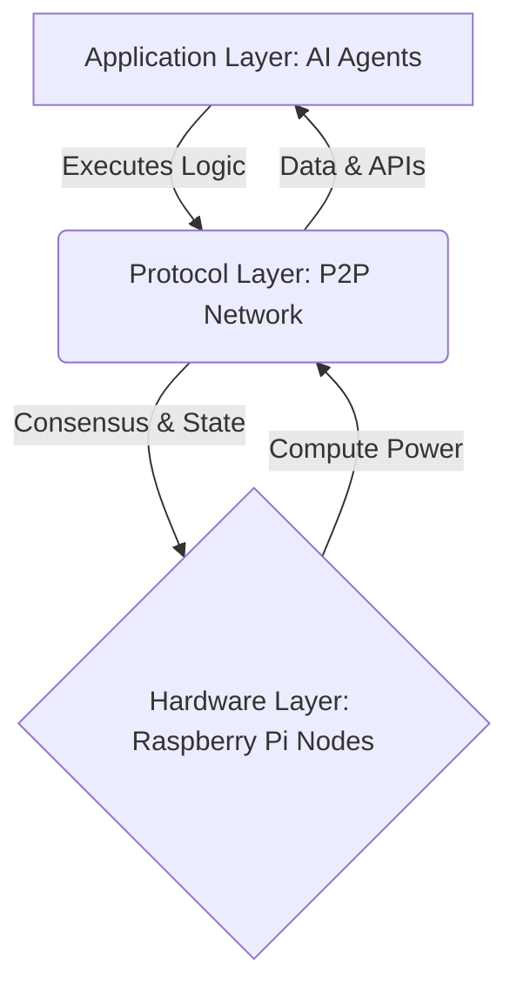

<div align="center">
  

  # BerryClaw ($BCLAW)
  
  **From Generative AI to Agentic AI.**
  
  [](https://reactjs.org/)
  [](https://vitejs.dev/)
  [](https://tailwindcss.com/)
  [](https://ai.google.dev/)

  [Website](#) • [Whitepaper](#architecture) • [Twitter/X](https://x.com/BerryClawfun) • [Discord](#)
</div>

---

## 📖 Table of Contents
- [About the Project](#-about-the-project)
- [The Paradigm Shift](#-the-paradigm-shift)
- [Key Features](#-key-features)
- [Architecture](#-architecture)
- [Tokenomics](#-tokenomics)
- [Getting Started](#-getting-started)
- [Roadmap](#-roadmap)
- [Community](#-community)

---

## 🚀 About the Project

**BerryClaw** introduces a decentralized protocol for autonomous AI agents, enabling them to execute tasks, manage resources, and interact within a tokenized ecosystem. 

By leveraging edge computing devices like the **Raspberry Pi**, BerryClaw democratizes access to AI infrastructure, moving away from centralized cloud monopolies towards a resilient, distributed network of intelligent nodes.

---

## 🧠 The Paradigm Shift

For the past year, we've been living in the era of conversation. Tools like ChatGPT and Claude have shown us the power of Large Language Models, but they remain fundamentally reactive. 

**"They are assistants who can think, but they cannot act. Until now."**

By turning a simple Raspberry Pi into a dedicated AI Agent, we give the AI 'hands.' It no longer just tells you how to solve a problem—it executes the solution. It manages workflows, interacts with APIs, and runs terminal commands autonomously. With `$BCLAW`, we aren't just building another AI coin; we are fueling a decentralized workforce of agents that work for you 24/7 while you sleep.

---

## ✨ Key Features

- **🤖 Autonomous AI Agents:** Deploy agents that execute complex logic, from high-frequency trading to server management.
- **🌐 Decentralized Edge Computing:** Run nodes on low-cost hardware (Raspberry Pi) to secure the network and provide compute power.
- **💬 Integrated AI Assistant:** Built-in AI Assistant powered by **Google Gemini** to help users navigate the ecosystem and understand tokenomics.
- **🔐 Proof-of-Execution (PoE):** A novel consensus mechanism where nodes are rewarded for verifiable execution of AI tasks.
- **📊 Interactive Whitepaper:** Read the protocol blueprint directly on the platform with dynamic Mermaid.js architecture diagrams.

---

## 🏗 Architecture

The BerryClaw architecture is composed of three primary layers:

1. **The Application Layer:** The autonomous agents themselves, executing specific logic (e.g., Trading Bot, Server Node).
2. **The Protocol Layer:** A peer-to-peer network facilitating communication, consensus, and state management among nodes.
3. **The Hardware Layer:** Utilizing Raspberry Pi nodes for localized compute and storage.



---

## 💎 Tokenomics

The `$BCLAW` token is the native utility token of the BerryClaw ecosystem.

**Total Supply:** 1,000,000,000 $BCLAW

### Distribution
- **40%** - Community & Ecosystem
- **30%** - Node Rewards
- **15%** - Team & Development
- **10%** - Liquidity Pool
- **5%** - Advisors & Partners

### Token Utility
- ⚡ **Compute Payment:** Pay for AI agent execution and decentralized processing power.
- 🔒 **Node Staking:** Stake $BCLAW to run a node, secure the network, and earn PoE rewards.
- 👥 **Governance:** Vote on protocol upgrades, fee structures, and ecosystem grants.

---

## 💻 Getting Started

To run the BerryClaw web interface and AI Assistant locally:

### Prerequisites
- Node.js (v18 or higher)
- npm or yarn
- Google Gemini API Key (for the AI Assistant)

### Installation

1. Clone the repository:
   ```bash
   git clone https://github.com/BerryClaw/BerryClaw.git
   cd BerryClaw
   ```

2. Install dependencies:
   ```bash
   npm install
   ```

3. Set up environment variables:
   Create a `.env` file in the root directory and add your Gemini API key:
   ```env
   GEMINI_API_KEY=your_api_key_here
   ```

4. Start the development server:
   ```bash
   npm run dev
   ```

5. Open your browser and navigate to `http://localhost:3000`.

---

## 🗺 Roadmap

- **Phase 1 (Current):** Core protocol development, node software release, web interface launch, and initial agent deployment.
- **Phase 2:** Mainnet launch, token generation event (TGE), and decentralized governance implementation.
- **Phase 3:** Cross-chain interoperability and advanced AI model integration.

---

## 🤝 Community

Join the autonomous era and build the future of Agentic AI with us!

- **Twitter / X:** [@BerryClawfun](https://x.com/BerryClawfun)
- **GitHub:** [BerryClaw](https://github.com/BerryClaw/BerryClaw)

<br/>

<div align="center">
  <i>© 2026 BerryClaw Ecosystem. All rights reserved.</i>
</div>
